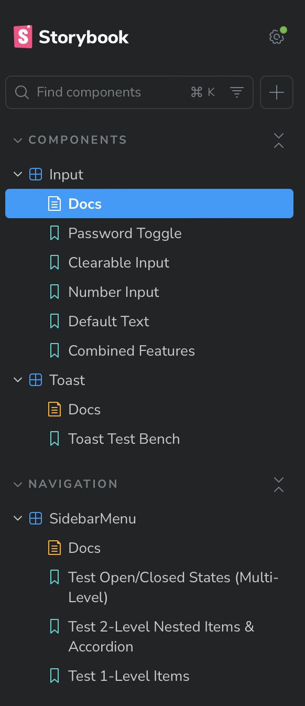
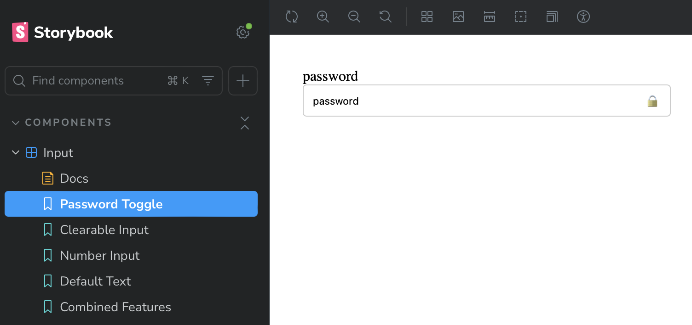
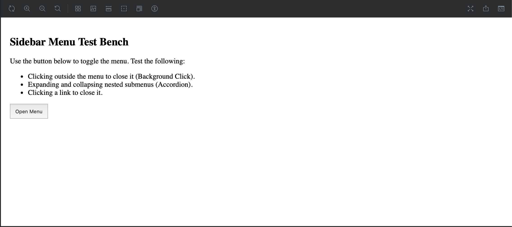
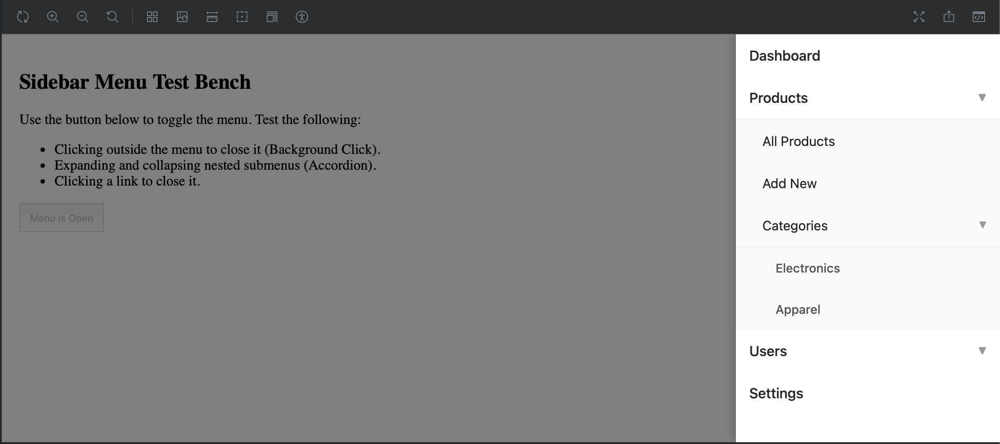
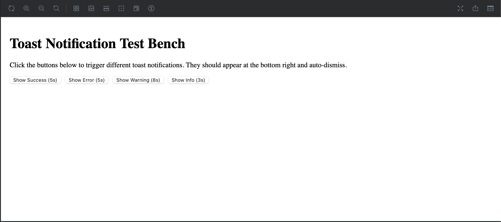
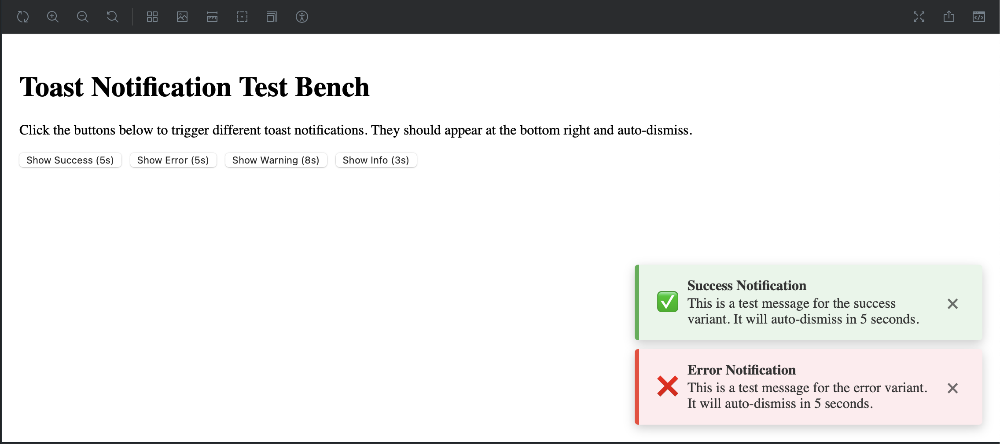

# Modern React Component Library

This repository contains a small collection of custom, reusable UI components built with **React**, **TypeScript**, and **Storybook**. The focus was on implementing complex functional requirements like controlled animations, state management, accessibility patterns, and modular design.

## Setup & Execution

Follow these steps to get the project running locally and view the component documentation.

1.  **Clone the Repository:**

    ```bash
    git clone [YOUR-REPO-LINK-HERE]
    cd [YOUR-REPO-NAME]
    ```

2.  **Install Dependencies:**

    ```bash
    npm install
    # or
    yarn install
    ```

3.  **Run Storybook:**
    To view all components, documentation, and live test benches:

    ```bash
    npm run storybook
    # or
    yarn storybook
    ```

    This will open Storybook in your default browser (usually at `http://localhost:6006`).

-----

## Component Overview & Usage

### 1\. Input Component (`Input/`)

A robust, multi-featured input component supporting password toggling and instant clearing.

#### Key Features:

| Feature | Implementation |
| :--- | :--- |
| **Password Toggle** | State management to switch input `type` between `password` and `text`, with a toggle icon. |
| **Clearable Input** | Conditional rendering of an 'X' button to instantly clear the input value. |
| **Spacing Control**| Refined CSS to ensure correct padding for zero, one, or two control icons across all states. |

#### Usage Example

```jsx
import { Input } from 'library-name'; 

const MyPasswordField = () => {
  const [password, setPassword] = useState('');
  
  return (
    <Input
      label="Password with Clear"
      type="password"
      value={password}
      onChange={(e) => setPassword(e.target.value)}
      canTogglePassword={true}
      isClearable={true}
      onClear={() => setPassword('')}
    />
  );
};
```

### 2\. Toast Notification (`Toast/`)

A fixed, auto-dismissing notification designed for seamless user feedback.

#### Key Features:

| Feature | Implementation |
| :--- | :--- |
| **Animation** | Smooth **slide-in** and **slide-out** animation powered by CSS transitions. |
| **Auto-Dismissal** | Uses `useEffect` and `setTimeout` for controlled dismissal after a set duration. |
| **Stacking** | Correctly implemented fixed positioning and stacking behavior for multiple concurrent toasts (bottom-right). |

#### Usage Example

```jsx
import { Toast, showSuccessToast } from 'library-name'; 

// 1. RENDER THE MANAGER ONCE (at the app root)
// This must be rendered to receive the notifications.
// <Toast /> 

// 2. TRIGGER A TOAST ANYWHERE ELSE:
const handleSave = () => {
    // Logic to save data...
    showSuccessToast("Profile updated successfully!");
};
```

### 3\. Sidebar Menu (`SidebarMenu/`)

A fully-functional, multi-level navigation sidebar with an accordion pattern.

#### Key Features:

| Feature | Implementation |
| :--- | :--- |
| **Slide Animation** | CSS transitions used for a smooth slide-in/slide-out from the right edge of the viewport. |
| **Outside Click** | Uses a custom `useClickOutside` hook to close the menu when the dark overlay is clicked. |
| **Nesting/Accordion** | Implemented using **recursion** in `SidebarMenuItem.tsx` to support arbitrary levels of nesting. |

#### Usage Example

```jsx
import { SidebarMenu } from 'library-name'; 

// Example usage to control the menu state:
const [isOpen, setIsOpen] = useState(false);

<SidebarMenu 
  items={menuItemsData} // Array of MenuItem[]
  isOpen={isOpen}
  onClose={() => setIsOpen(false)}
/>
```

-----

## Screenshots

### 1. Storybook Overview & Component States

| Section | State 1 | State 2 |
| :--- | :--- | :--- |
| **Storybook UI** |  | *(N/A)* |
| **Input Component** | **Password Hidden** <br>  | **Password Revealed** <br>  |
| **Sidebar Menu** | **Menu Closed** <br>  | **Menu Open** <br>  |
| **Toast Notification** | **Test Bench UI** <br>  | **Stacked Toasts** <br>  |